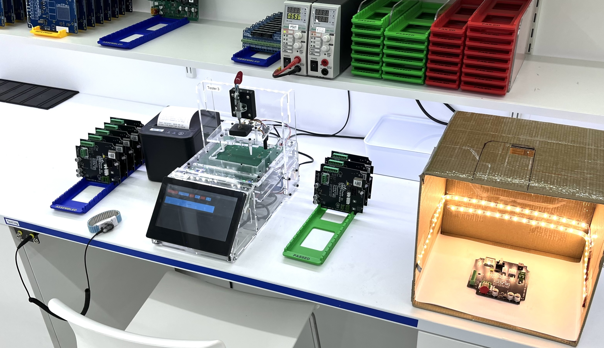
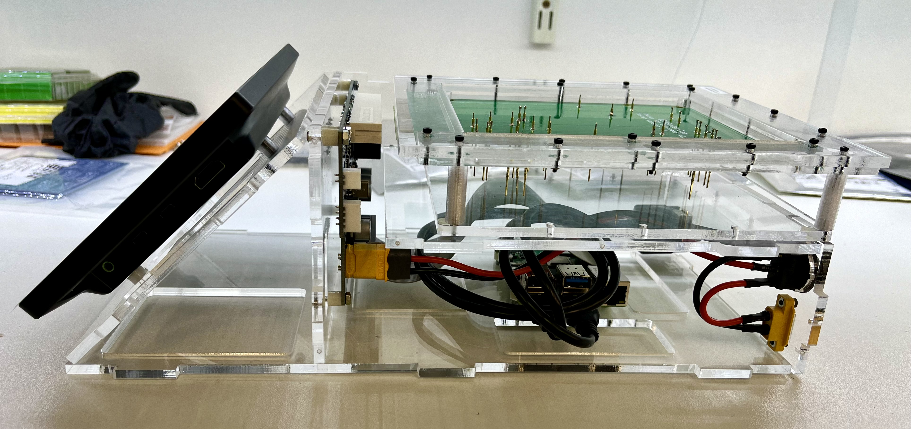
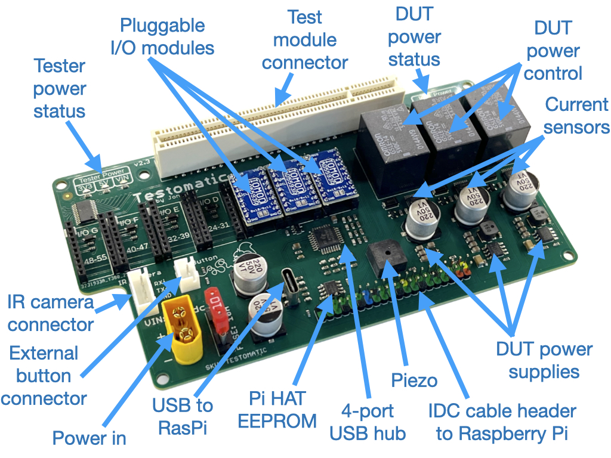
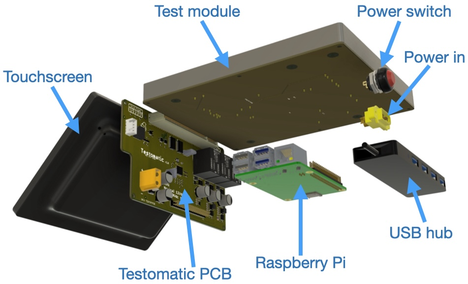
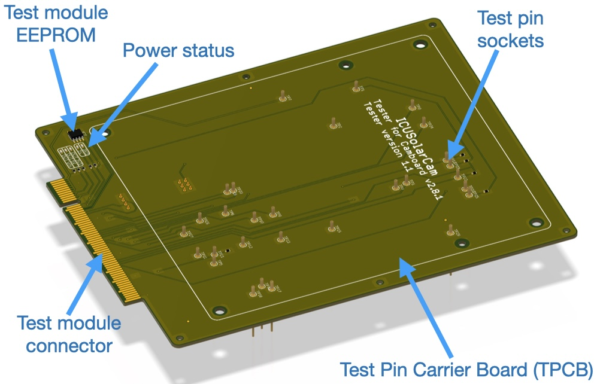
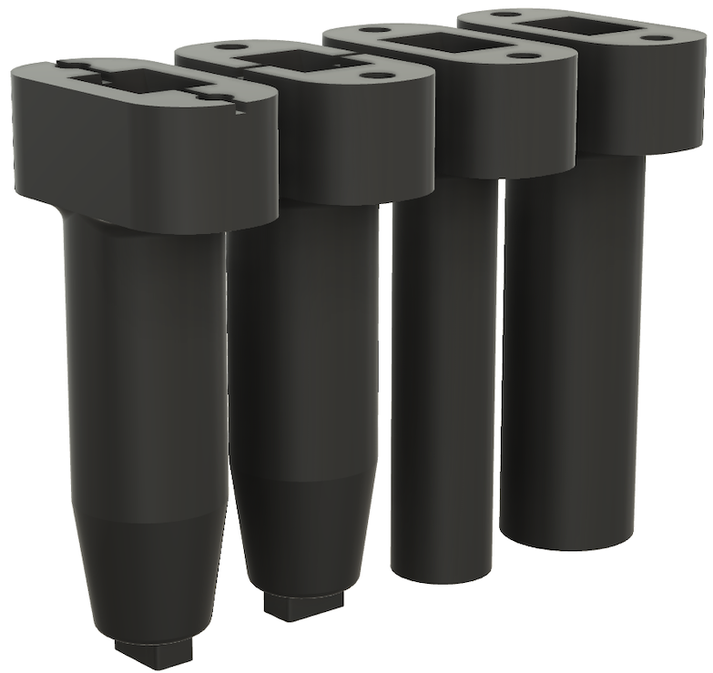
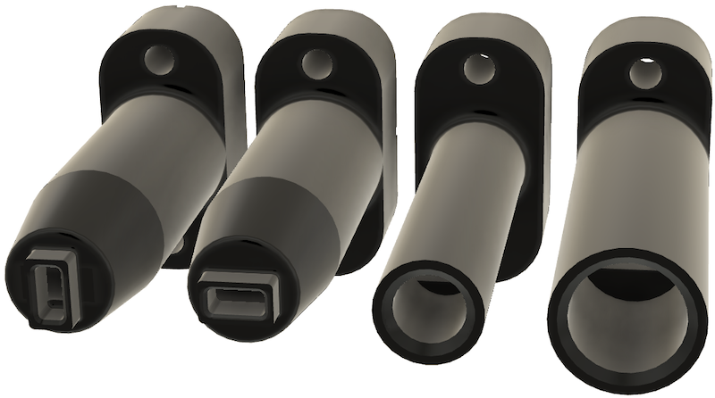

Testomatic PCB Test Jig System
==============================

Copyright 2024-2026 SuperHouse Automation Pty Ltd  [www.superhouse.tv]()

Testomatic is an open-source PCB test jig system with several goals:

1. Minimise reinvention when creating a test jig for a new **Device
Under Test (DUT)**.
2. Provide enough built-in I/O to **make the majority of tests easy**, with
expandability to **make harder tests possible**.
3. Allow the chassis to be quickly reused for multiple DUTs, with
each DUT having its own **Test Module**.
4. Integration with an **external test management / logging platform** for centralised storage of test results from one or more testers.

Testomatic is based around a Raspberry Pi, with a special PCB to provide additional I/O and protect the Pi from faults that may occur on the DUT. It uses removable Test Modules that provide the mechanical and electrical connection to each specific DUT. Currently we're using a simple Python testrunner script which has support for definition of multiple target boards, and can be controlled via the touchscreen using a control panel created using Node-RED Dashboard v2.

This is definitely a work in progress and the design is rapidly
developing. Most development and discussion of this project has taken
place on [SuperHouseTV livestreams](https://www.youtube.com/superhousetv) on YouTube, and on the [SuperHouse
Discord](https://www.superhouse.tv/discord/).

The new v2 system is still in development and uses a vertically-mounted PCB with a card edge connector for bridging between the Raspberry Pi and the Test Module:

The v2.3 **Testomatic PCB**:

The **Testomatic PCB** fits into a laser-cut chassis with various other
parts:

**Test Modules** are built around a **Test Pin Carrier Board (TPCB)** which
uses a card edge connector commonly used for PCI to pass signals
between the Testomatic system and the test pins:

A reference design for the TPCB has been created as a starting point for making DUT-specific versions.

## Features
* 56 GPIOs grouped as 7 blocks, each with 8 pins.
* Each GPIO block can be configured for 3.3V or 5V I/O.
* Each GPIO pin can be digital input, digital output, 12-bit ADC, or 12-bit DAC.
* 4-port USB hub with all 4 ports passed up to the test module.
* SPI and I2C passed up to test module.
* Pi HAT EEPROM on Testomatic PCB for compliance with HAT automatic configuration.
* I2C EEPROM can be placed on Test Module to allow Testomatic to automatically identify which module is loaded.
* 5V power supply dedicated to Raspberry Pi independently of the DUT.
* 5V power supply with current sensing dedicated to DUT.
* 3V3 power supply with current sensing dedicated to DUT.
* VIN is passed to DUT with current sensing.
* Independent relay control of all 3 power rails to DUT.
* 1024 x 600 capacitive touchscreen.
* USB hub mounted in chassis for external connection of receipt printer, barcode scanner, keyboard, etc.
* Support for a 32-24 pixel thermal camera that can be mounted externally for capturing thermal images of the DUT.
* Support for an external button, such as a foot switch for control of test start.

## I/O Modules

Each block of 8 I/O pins is exposed on an I/O Module header, in 2mm pitch DIP format. This allows the use of different I/O modules to suit your needs. A generic I/O Module has been designed based on the AD5593R I2C I/O expander chip. Any pin on this module can be configured to be a digital input or output, analog input, or analog output.

Details of the module are available at [github.com/SuperHouse/IOMOD](https://github.com/SuperHouse/IOMOD)

The plan is to create other modules with different capabilities if required.

## Expansion
Simple tests can be done with the included I/O pins, but many DUTs will require more specific connections. Because the Test Module has SPI, I2C, and USB available, you can build your own custom circuitry directly into the Test Pin Carrier Board. This could include:

* USB-to-Serial converters
* CAN bus interfaces
* RS485 interfaces
* Dummy loads (either onboard or external)
* Light sensors
* Signal generators
* Programmable power supplies

To simplify this process for common tests, we have begun creating small modules that can be added quickly to the design of your Test Pin Carrier Board to save you doing this yourself. These modules include:

 * [USB-to-Serial / ESPFlasher](https://github.com/SuperHouse/ESPFMOD) (complete)
 * [CAN bus](https://github.com/SuperHouse/CANMOD) (complete)
 * [UPDI Programmer / Serial Module](https://github.com/SuperHouse/UPDIMOD)] (complete)

## LED Testing

Instead of relying on visual confirmation by an operator, Testomatic can use light sensors to 
validate correct operation of LEDs. These sensors can detect not only the level of illumination, 
but also the intensity at different wavelengths to verify that the correct colour of LED has 
been placed.

The "ColourSensor" directory contains Fusion design files and STLs for 30mm-long shrouds for 
mounting a VEML3328SL colour sensor, which in turn can be connected via I2C to the Testomatic. 

Designs are provided to suit 0603 LEDs in both straight and lateral orientations, and 3mm and 
5mm PTH LEDs.

The VEML3328SL can be carefully hand-soldered to the ends of thin wires connected to a JST-SH 
1mm connector for compatibility with Qwiic and Stemma, including breakout boards and multiplexers.

The VEML3328SL has a fixed I2C address of 0x10 so a common approach is to use a TCA9548A or 
PCA9546A I2C multiplexer to allow multiple colour sensors to be used.

## Installation
Schematic and PCB were created in Fusion360 and exported as EAGLE format,
which can be imported back into Fusion360 or various other packages including KiCAD.

## Credits
Designed by Jonathan Oxer <jon@oxer.com.au> with the assistance of many members of the SuperHouse Discord.

## Distribution
The specific terms of distribution of this project are governed by the
license referenced below.

## License
Licensed under the TAPR Open Hardware License (www.tapr.org/OHL).
The "license" folder within this repository also contains a copy of
this license in plain text format.
