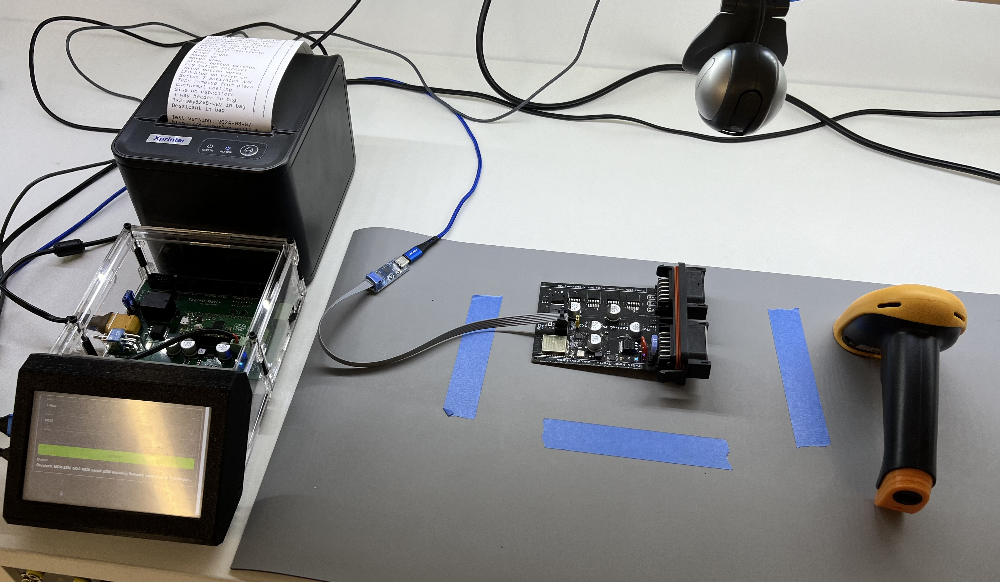

Testomatic PCB Test Jig System
==============================

Copyright 2024 SuperHouse Automation Pty Ltd  www.superhouse.tv

Working files for our internal PCB test jig system. Very rough,
definitely a work in progress and only put here so people can see
progress and make suggestions.

INSTALLATION
------------
Schematic and PCB were created in Fusion360 and exported as EAGLE format,
which can be imported back into Fusion360 or various other packages.

CREDITS
-------
Designed by Jonathan Oxer <jon@oxer.com.au>

DISTRIBUTION
------------
The specific terms of distribution of this project are governed by the
license referenced below.

LICENSE
-------
Licensed under the TAPR Open Hardware License (www.tapr.org/OHL).
The "license" folder within this repository also contains a copy of
this license in plain text format.
