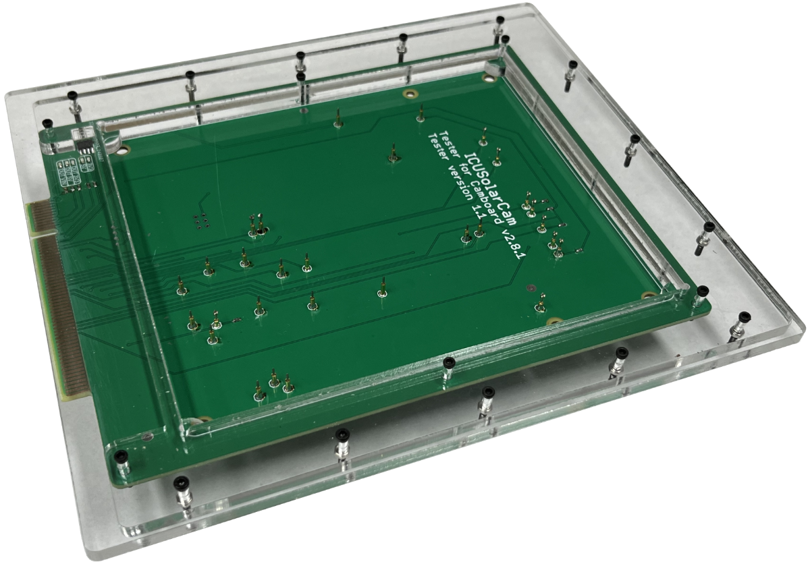
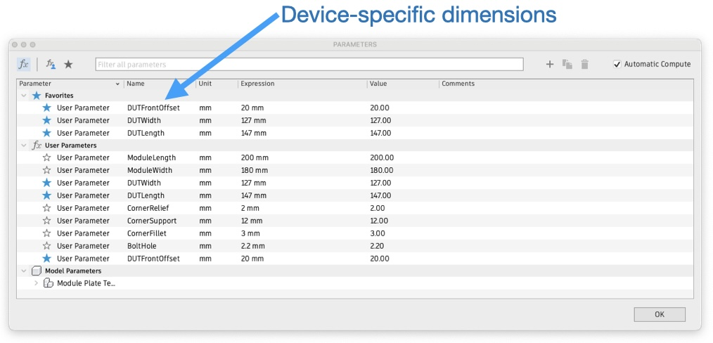
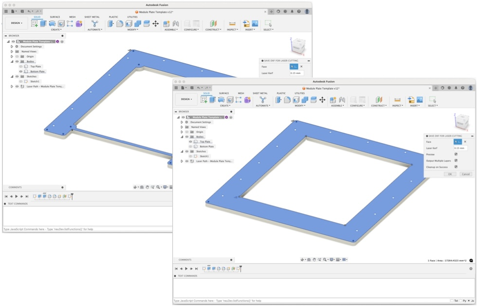

Creating a Test Module
======================

The Test Module supports the DUT mechanically, and connects it electrically
to the test system.

You need to create one test module for each type of device that you wish to test. Test modules
can be swapped out as required.

## Test Pin Carrier Board (TPCB)

To do: Notes here about designing your TPCB.

## Laser-cut frame

1. Open "Module Plate Template" in Fusion360.
2. Open "Modify" -> "Parameters".

3. Set "DUTWidth" to the horizontal width of your DUT.
4. Set "DUTLength" to the front-back length of your DUT.
5. Set "DUTFrontOffset" to the distance from the front of your Test Pin Carrier Board and the front edge of your DUT when mounted on it.
6. Close parameters dialog.
7. Turn on Bodies -> Top Plate AND Bottom Plate.
8. Create mounting holes to suit the design of your Test Pin Carrier Board.
9. Turn on only Bodies -> Top Plate, select top surface, and save as DXF for lasercutting.
10. Turn on only Bodies -> Bottom Plate, select top surface, and save as DXF for lasercutting.

11. Laser-cut both parts using 4.5mm acrylic. The thickness of the bottom plate is critical to set the vertical alignment of the connector.
12. Bolt the Top Plate and the Bottom Plate together using M2 bolts. You can optionally countersink them for a smooth top surface.
13. Bolt your Test Pin Carrier Board to the bottom of the assembly.
